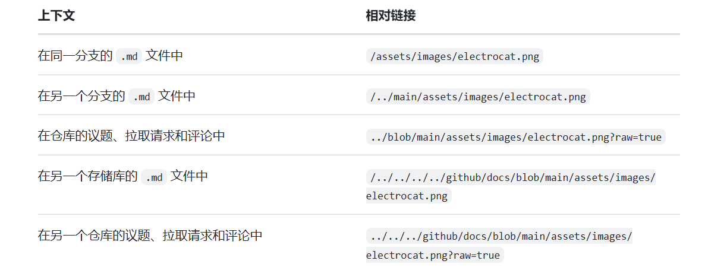

# markdown

markdown on github

## 标题

以n个#加空格开头，表示第n级标题

```markdown
# 一级标题
## 二级标题
### 三级标题
#### 四级标题
```

## 文本样式

| style | 语法| 输出|
| --------------- | --------------- | --------------- |
| 加粗 | `**text**` | **text** |
| 斜体 | `*text*` | *text* |
| 加粗与斜体 | `***text***` | ***text*** |
| 删除线 | `~~text~~` | ~~text~~ |
| 粗体和嵌入的斜体 | `**te_x_t**` | **te_x_t** |
| 上标 | `text<sup>text</sup>` | text<sup>text</sup> |
| 下标| `<textsub>text</sub>` | text<sub>text</sub> |

## 引用文本

使用>加空格表示引用文本，同时具有缩进

```markdown
> the text is quote
```

this text is not quote
> the text is quote

## 引用代码

以``包裹的片段不会被格式化

```markdown
`git commit`
```

以连续的三个`表示代码块

```markdown
git status
git add
git commit
```

## colors

似乎支持不好，暂时跳过此节
`#000000`

## 链接

```markdown
[文本](https://github.com/butterswings/markdown)
```

[文本](https://github.com/butterswings/markdown)

## 章节链接

```markdown
[跳转至总标题](#markdown)
```

[跳转至总标题](#markdown)

## 相对链接

对于克隆的仓库，如果持有者使用绝对链接，则会产生问题，使用相对链接利好仓库克隆

```markdown
[相对链接](./README.md)
```

[相对链接](./README.md)

## 自定义定位点

<a name="my-custom-anchor-point">自定义定位点</a>

```markdown
<a name="my-custom-anchor-point"></a>
```

[测试自定义定位点](#my-custom-anchor-point)

## IMAGE

```markdown

```


- 其他特殊仓库图像链接


## [指定图像显示的主题](https://docs.github.com/zh/get-started/writing-on-github/getting-started-with-writing-and-formatting-on-github/basic-writing-and-formatting-syntax#specifying-the-theme-an-image-is-shown-to)

此处不常见，详情见链接

## 列表

- 使用-，*，+来标识无序列表
- 使用1. 2. 3. ...... n.标识顺序列表
- 两种列表可以使用缩进任意嵌套

## 任务列表

```markdown
- [ ] 完成markdown on github
- [x] 完成markdown on github
```

- [ ] 完成markdown on github
- [x] 完成markdown on github

如果要以括号为文本开头需要使用\字符进行转义

## 提及人员和团队

- [见github](https://docs.github.com/zh/get-started/writing-on-github/getting-started-with-writing-and-formatting-on-github/basic-writing-and-formatting-syntax#mentioning-people-and-teams)

## 引用议题和拉取请求

- [见github](https://docs.github.com/zh/get-started/writing-on-github/getting-started-with-writing-and-formatting-on-github/basic-writing-and-formatting-syntax#referencing-issues-and-pull-requests)

## 引用外部资源

- [见GitHub](https://docs.github.com/zh/get-started/writing-on-github/getting-started-with-writing-and-formatting-on-github/basic-writing-and-formatting-syntax#referencing-external-resources)

## emoji

```markdown
:+1:
```

以:包裹的表情，[其他表情](https://github.com/ikatyang/emoji-cheat-sheet/blob/master/README.md)

:+1:

## 段落

以空行划分出新的段落

段落1

段落2

## 脚注

去往脚注1[^1]

去往脚注2[^2]

[^1]: 这是脚注一
[^2]: 这是脚注二

## 警报

```markdown
> [!NOTE]

> [!TIP]

> [!IMPORTANT]

> [!WARNING]

> [!CAUTION]
```

> [!NOTE]
> NOTE here
---
> [!TIP]
> TIP here
---
> [!IMPORTANT]
> IMPORTANT here
---
> [!WARNING]
> WARNING here
---
> [!CAUTION]
> CAUTION here
